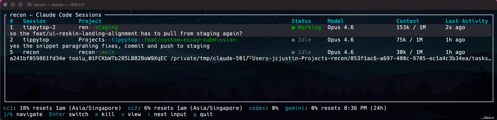

# recon

A tmux-native dashboard for managing AI coding agent sessions (Claude Code, Codex, Gemini).

Run multiple agent sessions in tmux across different projects, then manage them all without ever leaving the terminal — see what each agent is working on, which ones need your attention, switch between them, kill or spawn new ones, and resume past sessions. All from a single keybinding.


## Views

### Table View (default)



The table view shows all active sessions with their status, model, context usage, and last activity. A stats bar at the bottom displays rate-limit usage for each installed agent account.

```
┌─ recon — Claude Code Sessions ──────────────────────────────────────────────────────────────────────────┐
│  #  Session          Project                    Status   Model       Context  Last Active               │
│  1  api-refactor     myapp::feat/auth            ● Input  Opus 4.6    45k/1M   2m ago                   │
│       Implement OAuth2 PKCE flow with refresh token rotation                                            │
│  2  debug-pipeline   infra::main                 ● Work   Sonnet 4.6  12k/200k < 1m                     │
│  3  write-tests      myapp::feat/auth            ● Work   Haiku 4.5   8k/200k  < 1m                     │
│  4  code-review      webapp::pr-452              ● Idle   Sonnet 4.6  90k/200k 5m ago                   │
│     scratch          recon::main                 ● Idle   Opus 4.6    3k/1M    10m ago                  │
└─────────────────────────────────────────────────────────────────────────────────────────────────────────┘
cc1: 15% resets 1am  cc2: 6% resets 1am  codex: 0%  gemini: 0% resets 8:31 PM (24h)
j/k navigate  Enter switch  x kill  v view  i next input  q quit
```

- **Input** rows are highlighted — these sessions are blocked waiting for your approval
- **Last message preview** appears as a second line under each session row
- **Tags** in the `#` column (set with `recon launch 1`) sort sessions alphanumerically, tagged first
- **Stats bar** shows rate-limit usage % for each installed agent, fetched automatically on state changes

### Tamagotchi View (`recon view` or press `v`)

A visual dashboard where each agent is a pixel-art creature living in a room. Designed for a side monitor — glance over and instantly see who's working, sleeping, or needs attention. The account stats bar appears at the bottom here too.

Creatures are rendered as colored pixel art using half-block characters. Working and Input creatures animate; Idle and New stay still.

| State | Creature | Color |
|-------|----------|-------|
| **Working** | Happy blob with sparkles and feet | Green |
| **Input** | Angry blob with furrowed brows | Orange (pulsing) |
| **Idle** | Sleeping blob with Zzz | Blue-grey |
| **New** | Egg with spots | Cream |

- **Rooms** group agents by git repository — worktrees of the same repo share a room, while monorepo sub-projects get their own (e.g. `myapp` vs `myapp › tools/cli`) (2×2 grid, paginated)
- **Zoom** into a room with `1`-`4`, page with `j`/`k`
- **Context bar** per agent with green/yellow/red coloring

The `#` column shows your tag when set (`recon launch 1`), otherwise the row number. Use tags to map sessions to your terminal tabs — when a session shows **Input**, glance at the `#` to know which tab to switch to.

- **Working** sessions are actively streaming or running tools
- **Idle** sessions are done and waiting for your next prompt
- **New** sessions haven't had any interaction yet

## How it works

recon is built around **tmux**. Each Claude Code instance runs in its own tmux session.

```
┌─────────────────────────────────────────────────────────┐
│                      tmux server                        │
│                                                         │
│  ┌───────────────┐  ┌───────────────┐  ┌──────────────┐ │
│  │ session:      │  │ session:      │  │ session:     │ │
│  │ api-refactor  │  │ debug-pipe    │  │ scratch      │ │
│  │               │  │               │  │              │ │
│  │  ┌──────────┐ │  │  ┌──────────┐ │  │  ┌────────┐  │ │
│  │  │  claude  │ │  │  │  claude  │ │  │  │ claude │  │ │
│  │  └──────────┘ │  │  └──────────┘ │  │  └────────┘  │ │
│  └───────┬───────┘  └───────┬───────┘  └───────┬──────┘ │
│          │                  │                  │        │
└──────────┼──────────────────┼──────────────────┼────────┘
           │                  │                  │
           ▼                  ▼                  ▼
     ┌──────────────────────────────────────────────┐
     │                 recon (TUI)                   │
     │                                               │
     │  reads:                                       │
     │   • tmux list-panes → PID, session name       │
     │   • ~/.claude/sessions/{PID}.json             │
     │   • ~/.claude/projects/…/*.jsonl              │
     │   • tmux capture-pane → status bar text       │
     └──────────────────────────────────────────────┘
```

**Status detection** inspects the Claude Code TUI status bar at the bottom of each tmux pane:

| Status bar text | State |
|---|---|
| `esc to interrupt` | **Working** — streaming response or running a tool |
| `Esc to cancel` | **Input** — permission prompt, waiting for you |
| anything else | **Idle** — waiting for your next prompt |
| *(0 tokens)* | **New** — no interaction yet |

**Session matching** uses `~/.claude/sessions/{PID}.json` files that Claude Code writes, linking each process to its session ID. No `ps` parsing or CWD-based heuristics.

**Usage tracking** spawns a hidden background tmux session per agent whenever a session transitions from active → idle (or on startup), runs the agent's built-in usage command (`/usage` for Claude, `/status` for Codex, `/stats` for Gemini), and parses the rate-limit percentage from the output. Results are cached and displayed in the stats bar at the bottom of both views.

## Install

```bash
cargo install --path .
```

Requires tmux and at least one supported agent: [Claude Code](https://claude.ai/claude-code), [Codex](https://github.com/openai/codex), or [Gemini CLI](https://github.com/google-gemini/gemini-cli).

## Usage

```bash
recon                                              # Table dashboard
recon view                                         # Tamagotchi visual dashboard
recon json                                         # JSON output (for scripting)

# Launch a new session in the current directory
recon launch                                       # claude, no tag
recon launch 1                                     # claude, tagged "1"
recon launch 2 --agent claude-2                    # second Claude account, tagged "2"
recon launch 3 --agent codex                       # Codex, tagged "3"
recon launch 4 --agent gemini                      # Gemini, tagged "4"
recon launch --name-only                           # print tmux session name, don't attach

# Interactive new session form (pick tag + agent, launches in current directory)
recon new

recon resume                                       # Interactive resume picker
recon resume --id <session-id>                     # Resume a specific session
recon resume --id <session-id> --name foo          # Resume with a custom tmux session name
recon next                                         # Jump to the next agent waiting for input
recon park                                         # Save all live sessions to disk
recon unpark                                       # Restore previously parked sessions
```

### Multi-account Claude

Add to your `~/.zshrc`:
```bash
cc2() { CLAUDE_CONFIG_DIR="$HOME/.claude-2" claude "$@"; }
```

Then use `recon launch --agent claude-2` to launch sessions under the second account.

### Parallel workflow

Open one terminal tab per task, run `recon launch <tab-number>` in each. Keep recon open in a dedicated tab or tmux popup. When a session shows **Input**, the `#` column tells you which tab needs attention.

```bash
# Tab 1
cd ~/Projects/api && recon launch 1

# Tab 2
cd ~/Projects/frontend && recon launch 2 --agent claude-2

# Tab 3 — keep recon open here as your dashboard
recon
```

### Keybindings — Table View

| Key | Action |
|---|---|
| `j` / `k` | Navigate sessions |
| `Enter` | Switch to selected tmux session |
| `i` / `Tab` | Jump to next agent waiting for input |
| `x` | Kill selected session |
| `v` | Switch to Tamagotchi view |
| `q` / `Esc` | Quit |

### Keybindings — Tamagotchi View

| Key | Action |
|---|---|
| `1`-`4` | Zoom into room |
| `j` / `k` | Previous / next page |
| `h` / `l` | Select agent (when zoomed) |
| `Enter` | Switch to selected agent (when zoomed) |
| `x` | Kill selected agent (when zoomed) |
| `n` | New session in room (when zoomed) |
| `Esc` | Zoom out (or quit) |
| `v` | Switch to table view |
| `q` | Quit |

## tmux config

The included `tmux.conf` provides keybindings to open recon as a popup overlay:

```bash
# Add to your ~/.tmux.conf
bind g display-popup -E -w 80% -h 60% "recon"        # prefix + g → dashboard
bind n display-popup -E -w 80% -h 60% "recon new"    # prefix + n → new session
bind r display-popup -E -w 80% -h 60% "recon resume" # prefix + r → resume picker
bind i run-shell "recon next"                         # prefix + i → jump to next input agent
bind X confirm-before -p "Kill session #S? (y/n)" kill-session
```

This lets you pop open the dashboard from any tmux session, pick a session with `Enter`, and jump straight to it.

## Contribution Policy

This project is not accepting code contributions (Pull Requests) at this time.

Due to the sensitive nature of reconnaissance and session tracking, I prefer to maintain full control over the codebase to ensure security and auditability.

Ideas and feedback are welcome! Please open an [Issue](https://github.com/gavraz/recon/issues) if you have a feature request or have found a bug. If I like an idea, I will implement it myself.

## License

MIT
